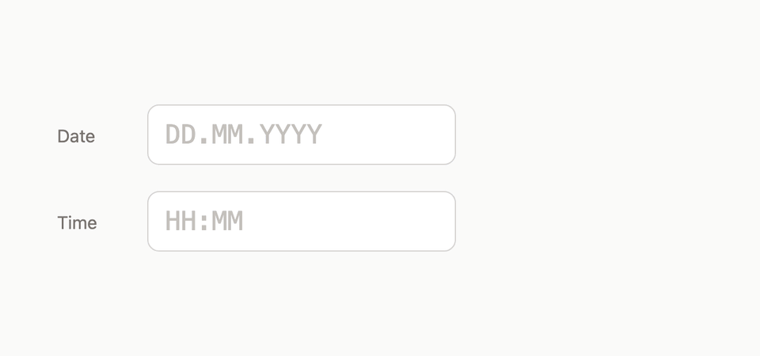

# ictus

**Date and time input mask** for a plain `<input>`. Formats `dd/mm/yyyy`, `mm/dd/yyyy`, or `yyyy-mm-dd` dates and `HH:mm` or `HH:mm:ss` times **as you type**. Headless, zero-dependency, **2.6 kB** gzipped. Optional React hook (`ictus/react`).



Attach it to the text input you already have. As you type, it formats the value, keeps the caret in the right place, normalizes pasted dates and times, and helps you parse or format them. Your design-system Input stays an input.

Docs: [ictus.luca-felix.com](https://ictus.luca-felix.com) · npm: [`ictus`](https://www.npmjs.com/package/ictus)

## Size and speed

Measured on this repo (`pnpm measure`). Min+gzip is what a bundler ships.

| Entry | minify | gzip |
| --- | ---: | ---: |
| `ictus` | 7.0 kB | **2.6 kB** |
| `ictus/time` | 5.7 kB | **2.3 kB** |
| `ictus/react` (react + core + time external) | 2.9 kB | **0.9 kB** |

`apply` is **0.1–0.2 µs** per keystroke (~5–8 million ops/s). Typing a full `11.12.2026` is about **2 µs**. `parseDate` is about **0.4 µs**. A 16 ms frame is tens of thousands of keystrokes; the work is a walk over at most ten characters, no DOM, no allocations beyond the returned `{ value, caret }`.

## Install

```bash
npm install ictus
```

Live demos and API reference: [ictus.luca-felix.com](https://ictus.luca-felix.com) (`pnpm docs` locally).

React starting blocks (shadcn Input, Base UI, Day Picker + popover) live under `registry/react/` and install via:

```bash
npx shadcn@latest add flixlix/ictus/date-field-shadcn
```

## When to use

Good fit when you want dates (`dd/mm/yyyy`, `mm/dd/yyyy`, `yyyy-mm-dd`) or 24-hour times (`HH:mm`, `HH:mm:ss`) typed into one text field, with formatting and caret behavior as someone types. Works with the Input you already have (vanilla `bindDateMask` / `bindTimeMask`, or React hooks). Dates and times only.

## Groups

| Group | Width | First digit | Second digit |
| --- | --- | --- | --- |
| Day | 2 | `4–9` → `0N.` · `0–3` stay | max 31 (`32–39` pad day and spill into month) |
| Month | 2 | `2–9` → `0N.` · `0–1` stay | max 12 (`13–19` pad month and spill into year) |
| Year | 4 | never pad | any 4 digits until parse |

The separator is configurable (default `.`). Typing `.`, `/`, or `-` commits the current group and writes the configured separator.

`mode` selects field order: `dmy` (default), `mdy`, or `ymd`. `parseDate` / `formatDate` accept the same `mode` (also as a positional second/third argument for the string form).

## API

```ts
import {
  apply,
  applyPaste,
  parseDate,
  dateStatus,
  formatDate,
  expandTwoDigitYear,
  isDateMaskKey,
  bindDateMask,
} from "ictus";

apply({
  value: string,          // current masked value
  caret: number,          // selection start (or collapsed caret)
  selectionEnd?: number,  // selection end, defaults to caret
  key: string,            // digit, `.` `/` `-`, Backspace, Delete
  separator?: string,     // default '.'
  mode?: "dmy" | "mdy" | "ymd", // default 'dmy'
  step?: number,          // default 0: ignore ArrowUp/ArrowDown
}): { value: string; caret: number }

applyPaste({
  value: string,
  caret: number,
  selectionEnd?: number,
  pasted: string,         // clipboard text
  separator?: string,
}): { value: string; caret: number }

parseDate(masked: string, options?: {
  mode?: "dmy" | "mdy" | "ymd";
  yyExpand?: { pivot?: number };
  min?: Date;
  max?: Date;
}): Date | undefined
dateStatus(masked: string): "empty" | "incomplete" | "invalid" | "valid"
formatDate(date: Date, separator?: string, options?: {
  mode?: "dmy" | "mdy" | "ymd";
  yyExpand?: { pivot?: number };
}): string
expandTwoDigitYear(yy: number, pivot?: number): number
isDateMaskKey(key: string): boolean

bindDateMask(input: HTMLInputElement, options?: {
  separator?: string;
  step?: number;              // default 0: ignore ArrowUp/ArrowDown
  onValueChange?: (value: string) => void;
  getValue?: () => string;
  setValue?: (value: string) => void;
}): () => void               // unsubscribe
```

`applyPaste` normalizes common clipboard shapes (`11/12/2026`, `11-12-2026`, `11.12.2026`, digit-only `11122026`, ISO `2026-12-11`) into the mask via the same group and overflow rules as `apply`. Non-date characters are ignored. ISO year-month-day with separators is remapped to day-month-year; digit-only strings stay DMY order.

`parseDate` returns a **local** `Date` (`new Date(year, monthIndex, day)`) only for a complete, calendar-valid triple. Optional `min` / `max` reject complete dates outside that local calendar-day range (still `undefined`). Partial and impossible strings stay in the input and parse to `undefined` without range checks. Reject never clears the box; selecting the value and deleting does.

`dateStatus` classifies a masked string for UI feedback: `""` → `empty`, a partial mask → `incomplete`, a complete `dd{sep}mm{sep}yyyy` that is not a calendar date → `invalid`, and a value `parseDate` accepts → `valid`.

`formatDate` writes `dd{sep}mm{sep}yyyy` from the date's local calendar parts.

### Optional arrow step

`step` defaults to `0` (off). When `step > 0`, `ArrowUp` / `ArrowDown` increment or decrement the caret’s current group by `step`. Day wraps in 1–31, month wraps in 1–12, year clamps to 0001–9999. An empty group seeds from today’s local day/month/year, then steps. Partial groups are treated as their typed integer and padded to width. The caret keeps its offset inside the group (clamped if the width changes). An empty group that seeds from today still places the caret at the end of that group. Left/Right, Home/End, and Page keys are not handled. Do not set `role="spinbutton"` on the input.

`isDateMaskKey` does **not** include arrow keys. Callers that opt in must treat them as handled themselves:

```ts
const step = 1;
if (
  isDateMaskKey(event.key) ||
  (step > 0 && (event.key === "ArrowUp" || event.key === "ArrowDown"))
) {
  event.preventDefault();
  // apply({ ..., key: event.key, step })
}
```

## Acceptance table

`separator = '.'`. `|` is the caret after the keystroke.

| Before | Key | After |
| --- | --- | --- |
| `\|` | `4` | `04.\|` |
| `\|` | `1` | `1\|` |
| `1\|` | `.` | `01.\|` |
| `13\|` | `.` | `13.\|` |
| `\|` | `.` | `\|` |
| `04.\|` | `.` | `04.\|` |
| `04.\|` | `9` | `04.09.\|` |
| `3\|` | `9` | `3\|` |
| `04.1\|` | `3` | `04.1\|` |
| `04.\|2.2026` | `1` | `04.12.\|2026` |
| `04.\|1.2026` | `2` | `04.\|1.2026` |
| `11\|` | `1` | `11.1\|` |
| `11.12.\|` | `⌫` | `11.12\|` |

Empty current group + separator is a no-op (`Blank + . → ""`). Backspace/Delete remove one visible character, including a trailing separator. Ctrl/Cmd+Backspace clears the active group (or the previous group at a boundary); Ctrl/Cmd+Delete clears the active group forward. Shift+Backspace or Shift+Delete clears the whole value. A selected range is deleted (select-all + delete clears the field).

## Vanilla `<input>`

```js
import { bindDateMask } from "ictus";

const input = document.querySelector("input");
const unbind = bindDateMask(input, {
  separator: ".",
  // step: 1, // optional; off by default
  onValueChange: (value) => console.log(value),
});

// later: unbind();
```

`bindDateMask` wires `keydown` (and paste) to `apply`, writes the result back to the input, and restores the caret. It returns a cleanup function that removes the listeners. Pass `getValue` / `setValue` when the masked string is owned outside the DOM.

ictus is headless: it does not own the DOM input. Restrict the field to mask keys (digits, separator keys, Backspace, Delete) in your own `keydown` handler so letters and other characters never enter the input value. The live docs demos do this; `bindDateMask` / `useDateFieldMask` leave non-mask keys to the browser so Tab, shortcuts, and arrows keep working. If a rejected character is already in the string, Backspace/Delete still drop it from the result so it cannot leak into mask state.

For a one-off keystroke without attaching listeners, call `apply` and `isDateMaskKey` yourself.

Live demos and the full API live in [`docs/`](docs/) (`pnpm docs`).

## React

`react` is an optional peer. The core stays zero-dependency.

```tsx
import { useDateFieldMask } from "ictus/react";

function DateInput() {
  const { inputProps, hiddenInputProps, isoValue, parsed, status } =
    useDateFieldMask({
    separator: ".",
    min: new Date(1900, 0, 1),
    max: new Date(2100, 11, 31),
    // step: 1, // optional; off by default
    onValueChange: (value) => console.log(value, parsed, status),
    onParsedChange: (date) => console.log(date),
  });

  return (
    <>
      <input {...inputProps} />
      <input name="date" {...hiddenInputProps} />
    </>
  );
}
```

Pass `value` for controlled mode (with `onValueChange` to update parent state). Omit `value` and use `defaultValue` for uncontrolled mode.

```tsx
function ControlledDateInput() {
  const [value, setValue] = useState("");
  const { inputProps, parsed } = useDateFieldMask({
    value,
    onValueChange: setValue,
  });

  return <input {...inputProps} />;
}
```

`inputProps` is `ref`, `value`, `onKeyDown`, `onPaste` (`preventDefault` + `applyPaste`), a no-op `onChange` (value is owned by `apply` / `applyPaste`), `inputMode="numeric"`, `autoComplete="off"`, and `spellCheck={false}`. The hook restores the caret after React commits. `parsed` is a local `Date` or `undefined`. `status` is the same classification as `dateStatus`. Pass `step` to enable ArrowUp/ArrowDown segment increment; it stays off when omitted.

`onParsedChange` runs when the parsed calendar day changes (`undefined` ↔ `Date`, or a different day)—not on every keystroke while the value stays incomplete. `isoValue` is `YYYY-MM-DD` when `parsed` is set, otherwise `""`. `hiddenInputProps` is `{ type: "hidden", value: isoValue }` for a native form field you can spread and name yourself.

## Time

Same headless mask model for a 24-hour clock, from `ictus/time`. Default shape is `HH:mm`; pass `precision: "second"` for `HH:mm:ss`. Separator defaults to `:`.

| Group | Width | First digit | Second digit |
| --- | --- | --- | --- |
| Hour | 2 | `3–9` → `0N:` · `0–2` stay | max 23 (`24–29` pad hour and spill into minute) |
| Minute | 2 | `6–9` → `0N` (plus `:` when seconds follow) · `0–5` stay | max 59 (spill into seconds when present; otherwise ignored) |
| Second | 2 | `6–9` → `0N` · `0–5` stay | max 59 (only with `precision: "second"`) |

Typing `:`, `.`, or `-` commits the current group and writes the configured separator.

```ts
import {
  applyTime,
  applyTimePaste,
  parseTime,
  timeStatus,
  formatTime,
  isoTime,
  isTimeMaskKey,
  bindTimeMask,
} from "ictus/time";

type TimeValue = { hours: number; minutes: number; seconds: number };

applyTime({
  value: string,
  caret: number,
  selectionEnd?: number,
  key: string,                     // digit, `:` `.` `-`, Backspace, Delete
  separator?: string,              // default ':'
  precision?: "minute" | "second", // default 'minute'
  step?: number,                   // default 0: ignore ArrowUp/ArrowDown
}): { value: string; caret: number }

applyTimePaste({
  value: string,
  caret: number,
  selectionEnd?: number,
  pasted: string,
  separator?: string,
  precision?: "minute" | "second",
}): { value: string; caret: number }

parseTime(masked: string, options?: {
  precision?: "minute" | "second";
  min?: TimeValue;
  max?: TimeValue;
}): TimeValue | undefined

timeStatus(masked: string, options?: { precision?: "minute" | "second" }):
  "empty" | "incomplete" | "invalid" | "valid"

formatTime(time: Date | TimeValue, separator?: string, options?: {
  precision?: "minute" | "second";
}): string
isoTime(time: TimeValue | undefined, precision?: "minute" | "second"): string
isTimeMaskKey(key: string): boolean

bindTimeMask(input: HTMLInputElement, options?: {
  separator?: string;
  precision?: "minute" | "second";
  step?: number;
  onValueChange?: (value: string) => void;
  getValue?: () => string;
  setValue?: (value: string) => void;
}): () => void                     // unsubscribe
```

`applyTimePaste` normalizes `9:45`, `09.45`, `0945`, and `14:30:15` into the mask with the same group and overflow rules as `applyTime`. Seconds are dropped unless `precision` is `"second"`, and AM/PM suffixes are ignored (`2:05 PM` becomes `02:05`).

`parseTime` returns a `TimeValue` only for a complete, clock-valid mask (`seconds` is `0` when `precision` is `"minute"`). Optional `min` / `max` reject complete times outside that range. `formatTime` writes `HH{sep}mm` (or `HH{sep}mm{sep}ss`) from a `TimeValue` or a `Date`'s local time. `isoTime` is the colon-separated form, or `""` for `undefined`.

With `step > 0`, `ArrowUp` / `ArrowDown` step the caret's group like the date mask: hours wrap 0–23, minutes and seconds wrap 0–59, and an empty group seeds from the current local time. `isTimeMaskKey` does not include arrow keys.

```js
import { bindTimeMask } from "ictus/time";

const unbind = bindTimeMask(document.querySelector("input"), {
  // precision: "second",
  onValueChange: (value) => console.log(value),
});
```

```tsx
import { useTimeFieldMask } from "ictus/react";

function TimeInput() {
  const { inputProps, hiddenInputProps, isoValue, parsed, status } =
    useTimeFieldMask({
      separator: ":",
      // precision: "second",
      min: { hours: 8, minutes: 0, seconds: 0 },
      max: { hours: 18, minutes: 0, seconds: 0 },
      onParsedChange: (time) => console.log(time),
    });

  return (
    <>
      <input {...inputProps} />
      <input name="time" {...hiddenInputProps} />
    </>
  );
}
```

`useTimeFieldMask` takes the same `value` / `defaultValue` / `onValueChange` / `step` options as `useDateFieldMask` and returns the same shape, with `parsed` as a `TimeValue`. `isoValue` is always colon-separated (`HH:mm` or `HH:mm:ss`) for form posts, regardless of the display separator.

### Time acceptance table

`separator = ':'`, `precision = "minute"`. `|` is the caret after the keystroke.

| Before | Key | After |
| --- | --- | --- |
| `\|` | `9` | `09:\|` |
| `\|` | `1` | `1\|` |
| `1\|` | `4` | `14:\|` |
| `2\|` | `4` | `2\|` |
| `1\|` | `:` | `01:\|` |
| `14:\|` | `6` | `14:06\|` |
| `14:5\|` | `9` | `14:59\|` |
| `14:6\|` | `0` | `14:6\|` |

## Releasing

This repo uses [Changesets](https://changesets.dev). On a branch with a user-facing change:

```bash
pnpm changeset
```

Merging to `main` opens a Version Packages PR. Merging that PR publishes to npm and creates a GitHub release.

Publishing needs an `NPM_TOKEN` repository secret. In the repo’s Actions settings, enable **Allow GitHub Actions to create and approve pull requests**.

## Limits for now

This release covers single date fields and single time fields. Combined date-time, ranges, and 12-hour clocks are future work. Pick field order with `mode` (`dmy` by default, or `mdy` / `ymd`). Pair with a calendar UI when the product needs both typing and picking.
